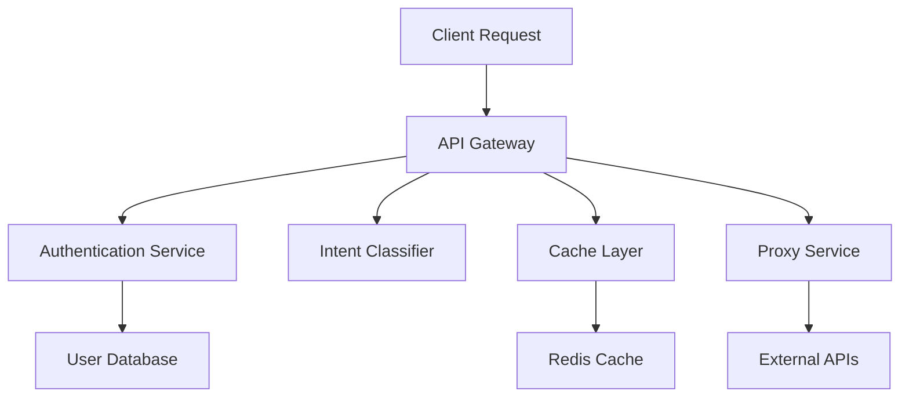

# 🔑 KeyPilot Demo Guide


> **⚠️ Important Notice**: This is a demo application focused on showcasing features and implementation. Please don't misuse the demo users and demo API keys. Keep your intentions good, use the platform responsibly, and share your feedback!

## 📺 Demo Walkthrough Video

*[Video will be embedded here showing complete platform walkthrough]*

---

## 🚀 Quick Start Guide

### Step 1: Login with Demo Credentials


Choose from any of the available demo user accounts:

```bash
Demo Users Available:
├── demo1 (password: demo123)
├── demo2 (password: demo456)  
└── demo3 (password: demo789)
```

**Instructions:**
1. Navigate to the login page
2. Select any demo user from the dropdown
3. The password will be auto-filled
4. Click "Login" to access the dashboard

---

### Step 2: Add API Keys


Use the demo API key feature for quick setup:

```javascript
// Demo API Key Format
sk-demo1234567890abcdef1234567890abcdef1234567890abcdef

// Auto-fill Process:
1. Click "Add New API Key" 
2. Click "Use Demo Key" button
3. Demo key automatically populated
4. Warning message displayed below
```

**Features:**
- ✅ One-click demo key generation
- ✅ Automatic validation
- ✅ Clear demo warnings
- ✅ No external API calls required

---

### Step 3: Configure Templates


Select from pre-configured templates for different AI providers:

```yaml
Available Templates:
  OpenAI:
    - GPT-4 Models
    - GPT-3.5 Turbo
    - Text Completion
  
  Anthropic:
    - Claude 3 Opus
    - Claude 3 Sonnet
    - Claude 3 Haiku
  
  Google:
    - Gemini Pro
    - Gemini Flash
    - PaLM Models
  
  Custom:
    - Custom Templates
    - Import/Export
    - Template Sharing
```

**Configuration Options:**
- 📊 Rate limiting settings
- 🔒 Security scopes
- 🌐 Allowed origins
- ⏰ Expiry dates
- 💾 Payload limits

---

### Step 4: Test Your Setup


Use the comprehensive testing suite:

```bash
🎯 Intent Testing
├── Natural language queries
├── Intent classification
├── Response routing
└── Accuracy metrics

⚡ Proxy Testing  
├── API call forwarding
├── Response caching
├── Error handling
└── Performance metrics

🔍 Cache Inspector
├── Real-time cache status
├── Hit/miss ratios
├── Cache invalidation
└── Storage analytics

📊 Real-time Analytics
├── Usage statistics
├── Performance monitoring
├── Error tracking
└── Trend analysis
```

---

## ✨ Key Features Overview

### 🔐 Security & Authentication
- **Multi-user demo accounts** with secure session management
- **API key encryption** and secure storage
- **Rate limiting** with customizable thresholds
- **Origin validation** for CORS security
- **Scope-based permissions** for fine-grained access control

### 📊 Analytics & Monitoring
- **Real-time dashboards** with live metrics updates
- **Usage tracking** across all API endpoints
- **Performance metrics** including response times
- **Error monitoring** with detailed stack traces
- **Trend analysis** for usage patterns

### 🎯 Intent Management
- **Natural language processing** for query understanding
- **Intent classification** with confidence scoring
- **Dynamic routing** based on intent analysis
- **Custom intent training** for domain-specific use cases
- **A/B testing** for intent model optimization

### ⚡ Performance & Caching
- **Intelligent caching** with configurable TTL
- **Response compression** for faster transfers
- **CDN integration** for global distribution
- **Load balancing** across multiple endpoints
- **Failover mechanisms** for high availability

---

## 🛠️ Technical Architecture

### Backend Services


### Frontend Stack
- **React 18** with hooks and context
- **Framer Motion** for smooth animations
- **Tailwind CSS** for responsive design
- **React Router** for client-side routing
- **React Hot Toast** for notifications

### Caching Strategy
```javascript
// Cache Configuration
const cacheConfig = {
  ttl: 300, // 5 minutes default
  maxSize: 1000, // Maximum cached items
  compression: true,
  encryption: false, // Demo mode
  strategies: ['LRU', 'LFU', 'TTL']
}
```

---

## 🧪 Testing Scenarios

### 1. Basic API Key Management
```bash
# Test Flow
1. Add demo API key
2. Configure rate limits
3. Set expiry date
4. Test key validation
5. Monitor usage metrics
```

### 2. Intent Classification Testing
```javascript
// Sample Test Queries
const testQueries = [
  "What's the weather like today?",
  "Generate a Python function for sorting",
  "Translate this text to Spanish",
  "Create a marketing email template"
]

// Expected Classifications
const expectedIntents = [
  "weather_query",
  "code_generation", 
  "translation",
  "content_creation"
]
```

### 3. Performance Testing
```bash
# Load Testing Scenarios
├── Concurrent users: 1-100
├── Request rate: 1-1000 req/sec
├── Cache hit ratio: >80%
└── Response time: <200ms
```

---

## 🔧 Configuration Options

### Environment Variables
```bash
# Frontend Configuration
VITE_API_BASE_URL=https://keypilot.onrender.com
VITE_DEMO_MODE=true
VITE_CACHE_ENABLED=true
VITE_ANALYTICS_ENABLED=true

# Feature Flags
VITE_ENABLE_REAL_API_CALLS=false
VITE_ENABLE_USER_REGISTRATION=false
VITE_ENABLE_PAYMENT_FLOW=false
```

### Demo Limitations
```yaml
Demo Restrictions:
  - API calls are mocked
  - Data resets every 24 hours
  - Maximum 5 API keys per user
  - Rate limit: 100 requests/hour
  - No real external API integration
  - Session timeout: 2 hours
```

---

## 💡 Best Practices for Demo Usage

### ✅ Do's
- **Explore all features** thoroughly
- **Test different scenarios** and edge cases
- **Provide constructive feedback** on UX/UI
- **Report bugs** with detailed reproduction steps
- **Share your experience** on social media
- **Suggest improvements** for the platform

### ❌ Don'ts
- **Don't attempt to exploit** security vulnerabilities
- **Don't use real API keys** in the demo environment
- **Don't attempt to access** non-demo data
- **Don't spam** the system with excessive requests
- **Don't share demo credentials** publicly
- **Don't use for production** workloads

---

## 🤝 Community & Feedback

### Share Your Experience
- 📝 **Blog about it** on [Dev.to](https://dev.to)
- 🐙 **Star the repo** on [GitHub](https://github.com/Joeljaison391/KeyPilot-Frontend)
- 🐦 **Tweet about it** with #KeyPilotDemo
- 💬 **Join discussions** in our community channels
- 📧 **Send feedback** to our development team

### Contributing
```bash
# How to Contribute
1. Fork the repository
2. Create a feature branch
3. Make your improvements
4. Write tests
5. Submit a pull request
6. Engage in code review
```

---

## 📱 Browser Compatibility

| Browser | Supported Versions |
|---------|-------------------|
| Chrome  | ✅ 90+ |
| Firefox | ✅ 88+ |
| Safari  | ✅ 14+ |
| Edge    | ✅ 90+ |

---

## ❓ Frequently Asked Questions

### Q: Can I use this in production?
**A:** No, this is a demo environment. For production use, contact our team for the full platform.

### Q: How often does demo data reset?
**A:** Demo data resets every 24 hours to ensure a fresh experience for all users.

### Q: Are API calls actually made to external services?
**A:** No, all API calls are mocked in the demo environment for security and cost reasons.

### Q: Can I create my own templates?
**A:** Yes! You can create custom templates and test them within the demo environment.

### Q: Is my data secure in the demo?
**A:** Demo data is temporary and regularly purged. Never enter sensitive information.

---

## 🏆 Success Metrics

Track your demo experience:

```bash
Completion Checklist:
□ Logged in with demo credentials
□ Added at least one API key
□ Configured a custom template
□ Tested intent classification
□ Explored the playground
□ Checked analytics dashboard
□ Tested cache functionality
□ Provided feedback
```

---

## 📞 Support & Contact

Need help during your demo experience?

- 📧 **Email**: demo-support@keypilot.io
- 💬 **Discord**: [Join our community](https://discord.gg/keypilot)
- 📖 **Documentation**: [Full docs](https://docs.keypilot.io)
- 🐛 **Bug Reports**: [GitHub Issues](https://github.com/Joeljaison391/KeyPilot-Frontend/issues)

---

*Made with ❤️ by the KeyPilot team. Happy testing! 🚀*
